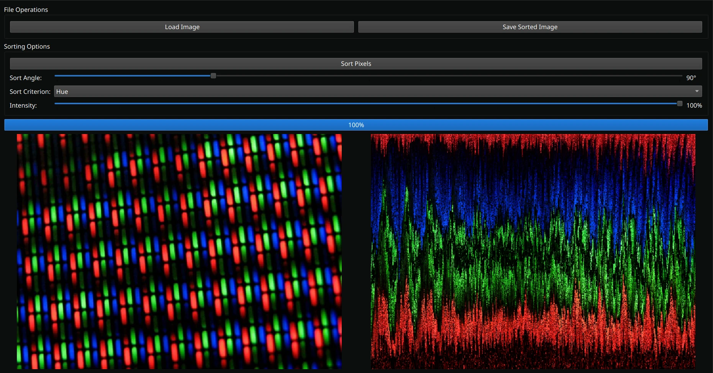

# pixFuck 🎨

A pixel-sorting playground built with Python and PyQt6! Transform your images into mesmerizing works of art by sorting pixels in creative ways. ✨




## ✨ Features

- 🎯 Modern and intuitive PyQt6 interface
- 🔄 Multiple sorting algorithms to play with
  - Brightness-based sorting
  - Hue-based sorting
  - Saturation-based sorting
  - Lightness-based sorting
- 📸 Support for various image formats
- 🖼️ Wide format support (JPEG, PNG, BMP, TIFF, GIF, WebP)
- 📝 Comprehensive logging system

## 🎨 Sorting Algorithms Explained

Each algorithm creates unique visual effects by sorting pixels based on different color properties:

### 🌟 Brightness-based Sorting
Sorts pixels based on their overall brightness (luminance). This creates dramatic light-to-dark or dark-to-light gradients, perfect for creating ethereal, flowing effects. Great for emphasizing the contrast in your images!

### 🌈 Hue-based Sorting
Arranges pixels according to their color hue in the HSL color space. This creates beautiful rainbow-like patterns, especially in images with diverse colors. The sorting follows the color wheel, making it ideal for creating psychedelic effects.

### 💫 Saturation-based Sorting
Organizes pixels by their color intensity or purity. This algorithm is particularly effective for creating dramatic effects in images with varying levels of color saturation. It can make dull areas pop or create smooth transitions between vibrant and muted regions.

### ✨ Lightness-based Sorting
Similar to brightness but works in the HSL color space, focusing on the lightness component. This creates more nuanced gradients than brightness-based sorting, as it's specifically designed to work with the human perception of lightness. Perfect for creating subtle, atmospheric effects.

Each algorithm can be combined with different sorting directions (horizontal, vertical, or diagonal) and thresholds to create unique artistic effects. Experiment with different combinations to discover your favorite style! 🎯

## 🛠️ Requirements

- Python 3.6 or higher
- PyQt6 >= 6.4.0
- Pillow >= 9.0.0
- numpy >= 1.20.0
- numba >= 0.55.0
- scipy >= 1.7.0

## 🚀 Installation

### Option 1: Using the Binary (Recommended for End Users)

1. Download the appropriate binary for your operating system from the releases page
2. Make the binary executable (Linux/macOS only):
```bash
chmod +x main.bin  # For Linux
chmod +x main.bin  # For macOS
```
3. Run the application:
```bash
./main.bin  # Linux/macOS
```

### Option 2: Running from Source (Recommended for Developers)

1. Clone the repository:
```bash
git clone https://github.com/evolvewithevan/pixFuck.git
cd pixFuck
```

2. Create and activate a virtual environment (recommended):
```bash
python -m venv venv
source venv/bin/activate  # On Linux/Mac
# or
.\venv\Scripts\activate  # On Windows
```

3. Install the required dependencies:
```bash
pip install -r requirements.txt
```

4. Run the application:
```bash
python main.py
```

### Building from Source

If you want to create your own binary:

1. Install Nuitka and its dependencies:
```bash
pip install nuitka ordered-set zstandard
```

2. Build the binary:
```bash
# Linux
python -m nuitka --standalone --follow-imports --enable-plugin=pyqt6 --include-package-data=PyQt6 --include-package-data=PIL --include-package-data=numpy --include-package-data=numba --include-package-data=scipy --include-data-dir=assets=assets --include-data-dir=ui=ui --onefile --remove-output main.py

# Windows
python -m nuitka --standalone --follow-imports --enable-plugin=pyqt6 --include-package-data=PyQt6 --include-package-data=PIL --include-package-data=numpy --include-package-data=numba --include-package-data=scipy --include-data-dir=assets=assets --include-data-dir=ui=ui --onefile --remove-output main.py

# macOS
python -m nuitka --standalone --follow-imports --enable-plugin=pyqt6 --include-package-data=PyQt6 --include-package-data=PIL --include-package-data=numpy --include-package-data=numba --include-package-data=scipy --include-data-dir=assets=assets --include-data-dir=ui=ui --onefile --remove-output main.py
```

Note: Building binaries requires compilation on the target platform. You cannot cross-compile from one platform to another.

## 🎮 Usage

### Using the Binary
1. Launch the application using the binary
2. Use the interface to:
   - Load an image
   - Select a sorting algorithm
   - Adjust sorting parameters
   - Save the processed image

### Using from Source
1. Run the application using `python main.py`
2. Use the interface to:
   - Load an image
   - Select a sorting algorithm
   - Adjust sorting parameters
   - Save the processed image

## 📁 Project Structure

```
pixFuck/
├── main.py              # Application entry point
├── requirements.txt     # Project dependencies
├── ui/                  # User interface components
│   ├── __init__.py
│   ├── logger.py       # Logging configuration
│   ├── pixel_sort_app.py # Main application window
│   └── worker.py       # Background processing worker
└── logs/               # Application logs
```

## 💻 Development

The project uses a modular structure with separate components for:
- 🖥️ UI handling (`pixel_sort_app.py`)
- ⚙️ Background processing (`worker.py`)
- 📝 Logging (`logger.py`)

## 📜 License

This project is licensed under the GNU General Public License v3.0 (GPL-3.0) - see the [LICENSE](LICENSE) file for details.

The GPL-3.0 is a strong copyleft license that ensures the software remains free and open source. This means:
- You are free to use, modify, and distribute the software
- You must make any modifications available under the same license
- You must include the original copyright notice and license
- You must make the source code available to anyone who receives the software

For more information about the GPL-3.0, visit: https://www.gnu.org/licenses/gpl-3.0.html

This project was previously unlicensed. As of now, it is licensed under GPLv3. Prior code is copyrighted and not licensed for reuse.

## 🤝 Contributing

Contributions are welcome! Please feel free to submit a Pull Request. By contributing to this project, you agree that your contributions will be licensed under the GPL-3.0 license.

---

Made with ❤️ and lots of pixels! 
